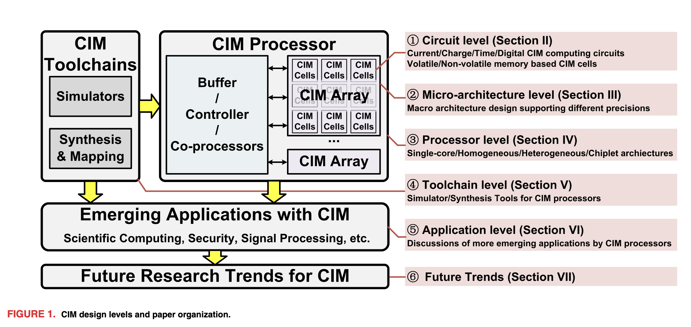
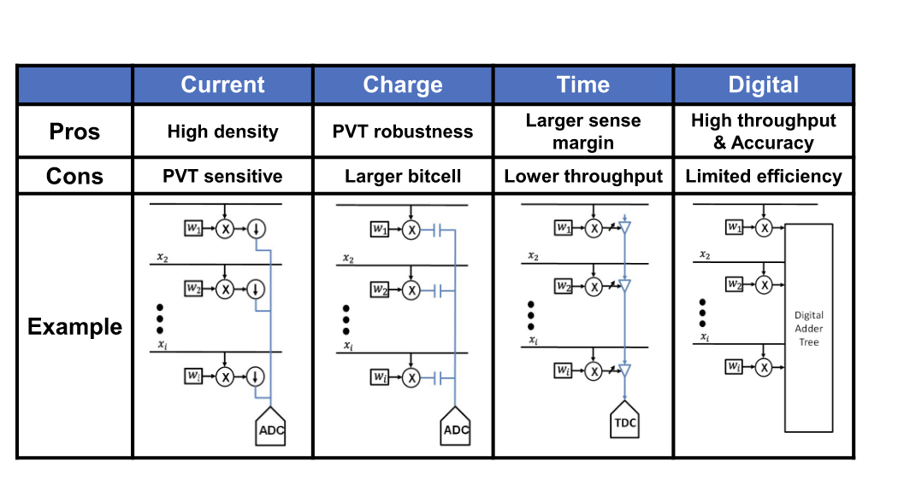
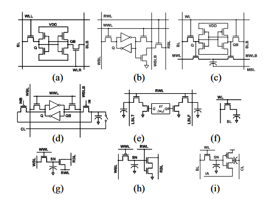
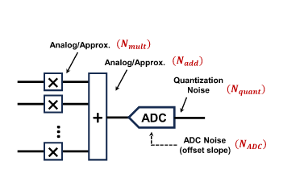
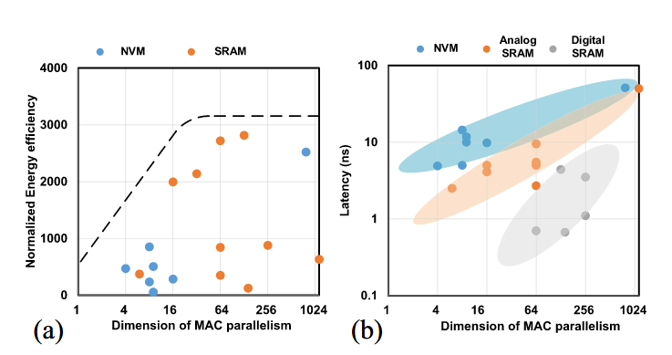
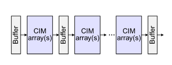
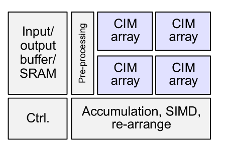
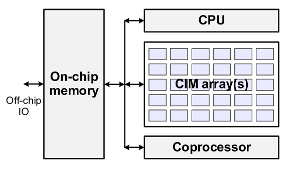
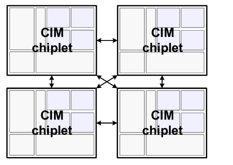

---
title: 'CiM Overview: Basics'
description: 'CiM是未来还是泡沫？'
publishDate: '2026-03-04'
updatedDate: '2026-03-04'
category: Research
tags:
  - Architecture
heroImage:
  src: './CiMBasics.jpg'
  alt: '文章封面'
  color: '#B4C6DA'
draft: false
language: 'zh-CN'
comment: true
---

import {
  Aside, Tabs, TabItem, Steps, MdxRepl, Card, Collapse, CardList, Timeline,
  Button, Spoiler, FormattedDate, Label, Svg, Icon
} from 'astro-pure/user'
import { Quote, GithubCard, LinkPreview, QRCode, MediumZoom } from 'astro-pure/advanced'
import { Icons as allIcons } from 'astro-pure/libs'
import { Comment } from '@/components/waline'
import { Code } from 'astro:components'
import { Image } from 'astro:assets'
import myImage from './CiMBasics.jpg'

export const cardListData = [
  { title: '文档链接', link: '/docs' },
  { title: '二级目录', children: [{ title: '子项', link: '/docs/integrations/components' }] }
]

export const timelineData = [
  { date: '2026-02-20', content: '开始写作' },
  { date: '2026-02-27', content: '发布文章' }
]

<Aside type='tip' title='Tips'>
CiM是最近发展的一个新技术，旨在通过在存储结构中直接处理数据来提高计算效率。以下是一个CiM的基本概念梳理，
介绍了常见的CiM架构以及设计时的一些权衡。
</Aside>

## Overview


CiM的整体架构，分为若干Level
- Circuit level：模拟的：基于电流/电压/Time，数字的
- Micro-architecture level
- Processor level：一个基本的CIM Processor如上图，可以看到Array负责大部分的计算，同时Buffer/Controller/Co-processors辅助进行计算进行数据的准备，以及完成一些Array无法完成的计算
- Toolchain Level：Simulators(性能/能耗/精度建模仿真)，Synthesis & Mapping(将实际的运算映射到CiM阵列上)
- Application level
- Future Trends

## Why CiM
### Memory/Bandwidth Wall(内存墙)
在传统的计算架构中，计算与存储一般是分开的。ALU运算得到的结果需要写回存储，同时ALU的数据也需要从存储中读取。

随着处理器性能的不断提升，计算的速度大大增加，但是数据搬运的延迟与能耗问题没有得到解决，因此系统性能被数据搬运所拖累，这个问题称为内存墙。在AI的计算中，数据量显著增加，这个问题更加显著。

CiM的核心思想就是把计算放在存储阵列中，在存储单元内部完成MAC.

CiM不是通用的计算单元，需要和其他通用计算单元配合来实现更加复杂的运算。

## Circuit level
物理层面的计算电路大致可以分为这几个原型



### Current-based
利用电流的KCL来实现累加，同时ADC完成模拟to数字的转换
这种结构的密度比较高，占的空间比较小，但是容易受器件性质与噪声的影响
### Charge-based
电容可以累积电荷，电荷的累积产生电压变化，这个量再ADC成数字就完成了计算，这种结构占的面积比较大。
### Time-based
电压越大需要累积的电荷也越多，积累的时间也越长，因此时间也可以作为一个测量的量。TDC是一种时延to数字的单元
这种方式受外界影响小，但是由于时延的存在导致效率较低
### Digital
数字的方法精度较高，将计算结果在加法树中累加，但是由于前三者用的是物理规律，数字的方法相比而言功耗会高很多。

## CiM Memory Circuits
做存算需要选择存算的存储介质，大体可分为易失性(SRAM,eDRAM)和非易失性(RRAM,MRAM,ROM)两类。



它们有如下的特点
- Volatile(SRAM/eDRAM)：SRAM的存算见(a)，其鲁棒性较高，易于继承，但单元面积较大导致CiM的效率不高。引入eDRAM后可以解决这个问题，但eDRAM的CiM需要定期刷新电容
- Non-volatile(RRAM/MRAM/ROM)：基于非易失性介质实现的存算具有较高的计算密度，然而其设计起来较为复杂，往往需要算法协同设计

## Micro-architecture level
CiM的Macro如图，其大致可分为CiM的计算阵列和外围的处理电路(ADC,DAC,累加电路)，其计算时的功耗也需要考虑CiM阵列和周围电路的总和



基于这个模型，可以实验得到各种存算方式的Energy Efficiency和Latency.可以看到增加计算的并行度，会导致Efficiency提高但存在一个饱和，不能无限提高， 同时计算的Latency也会提高。在各种存算方式中，基于非易失性介质的延迟范围更加分散，基于SRAM的存算相对延迟往往较低，且基于SRAM的数字存算延迟是最低的，因为这种方式严格控制了时序，且可以流水化。



另外Analog和Digital CiM的性能上限有各自的约束。对于Analog，其功耗上限往往取决于ADC和DAC的能耗和速度。对于数字CiM，加法树的计算消耗较大，且加法树的大小基本决定了计算的并行度，若要追求很大的并行度则路径会很多，相应的布局布线的面积就会非常难以管理，还会带来时序收敛的问题。

## Processor-level CiM Chips
基于之前提到的Macro，可以构成多种类型的CiM芯片，主要的有以下几种。
### Single-core and pipeline CiM Architecture


这种类型的电路是CiM芯片的最基础形态，通过CiM Arrays和Buffer交替构成，多个这种结构级联可以模拟基本的多个线性层堆叠的Neural Network运算，同时Buffer如果做成Ping-Pong的双缓冲结构，则可以实现流水功能，实现较高的运算效率
### Homogeneous CiM Architecture


这种结构引入了多个CiM阵列，并通过调度逻辑来控制不同的CiM来进行CiM的计算。这样一次性会产生很多数据，可以看到右下角的SIMD和累加，re-arrange逻辑对Array得到的结果进行了后处理，得到了最后的输出

### Heterogeneous CiM Architecture


相比于上面的同构计算逻辑，这个异构逻辑中CPU,Coprocessor更多地承担了计算任务，因此这三者的计算可以看作并行的，可以视作一种异构逻辑
### Chiplet CiM Architecture


如果单个CiM阵列做的过大，会导致许多的时序问题。为了解决这个问题人们提出了一种Chiplet片片互联的结构，每一块都是一个独立的CiM Chip，片与片之间进行数据交换来实现计算的拆解


{/* # 小组件

## Github风格的框

<Aside type='tip' title='Tips'>
Here is a tip for you.
</Aside>

<Aside type='caution' title='Warning'>
Warning occurs!
</Aside>

<Aside type='danger' title='Danger'>
Do not do this!
</Aside>

## Card
<Card as='a' href='#' heading='卡片标题' subheading='卡片副标题' date='Feb 2026'>
跳转到文章开头的卡片
</Card>

你好啊

<Card as='a' heading='卡片标题' subheading='卡片副标题' date='Feb 2026'>
不跳转
</Card>


## 折叠标签
<Collapse title='这里可以写不想让人看到的内容'>
Hello, this is some hidden content that can be revealed by clicking the title.
</Collapse>

## 标签页
<Tabs>
  <TabItem label='标签一'>这里是标签一内容</TabItem>
  <TabItem label='标签二'>这里是标签二内容</TabItem>
</Tabs>

## 步骤

<Steps>
1. 第一步
2. 第二步
3. 第三步
</Steps>

## 时间轴
<Timeline
  events={[
    { date: '2026-02-20', content: '开始写作' },
    { date: '2026-02-27', content: '发布文章' }
  ]}
/>


## 引用和批注
>hello

<MdxRepl width='100%'>
<p>小批注</p>
</MdxRepl>

## 按钮
<div class='flex gap-2'>
  <Button as='a' title='前进按钮' variant='ahead' />
  <Button as='div' title='返回按钮' variant='back' />
  <Button as='div' title='胶囊按钮' variant='pill' />
</div>

## 剧透
<Spoiler>这是剧透文本</Spoiler>

## Advanced 组件

显示语录
<Quote /> 
展示Github的仓库
<GithubCard repo='cworld1/astro-theme-pure' />
展示一个链接
<LinkPreview href='https://www.cloudflare.com/' hideMedia />
展示二维码
<QRCode content='https://github.com' class='inline-flex max-w-44 p-3 bg-muted rounded-lg border' />

## 图片与代码


<Code lang='bash' code={`echo "hello mdx"`} />

```bash title="deploy.sh"
bun check
bun dev # [!code highlight]
```

```diff
-bun run build # [!code --]
+bun format    # [!code ++] */}

