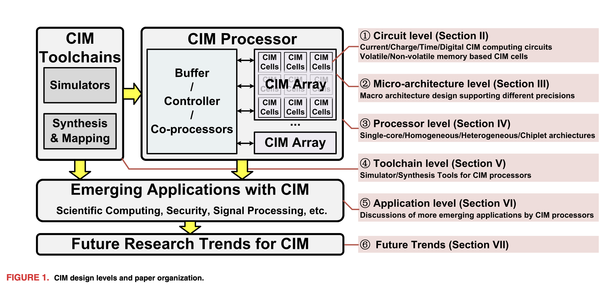
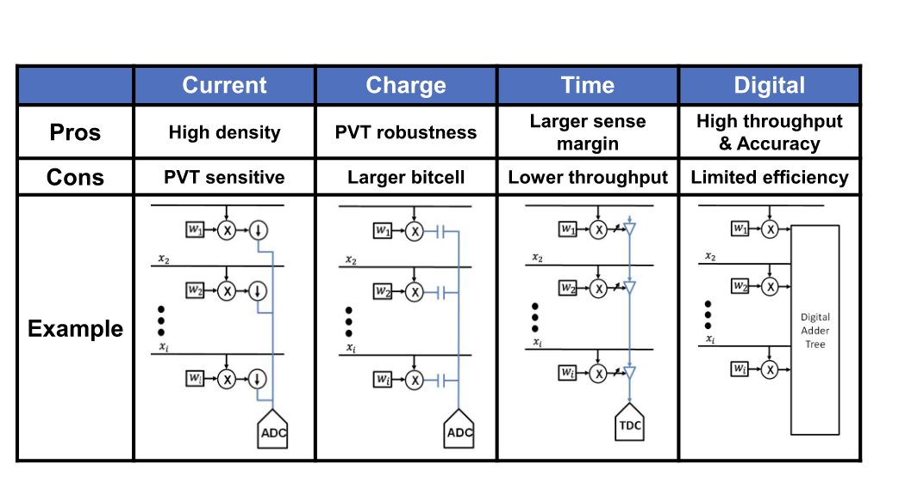
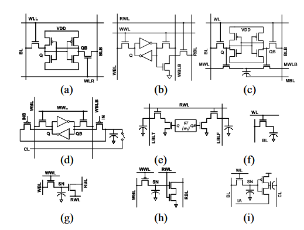
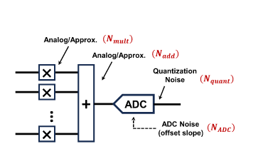
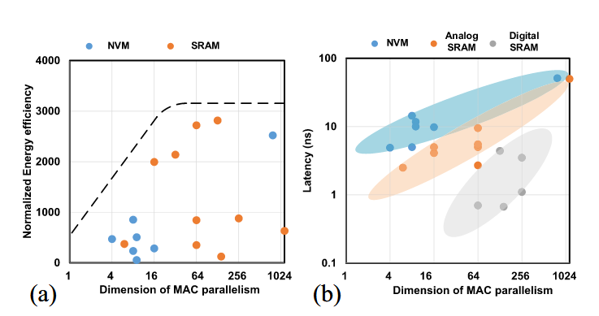
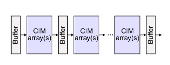
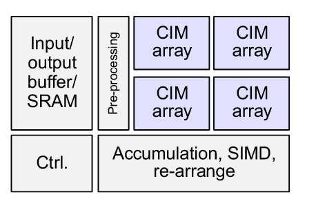
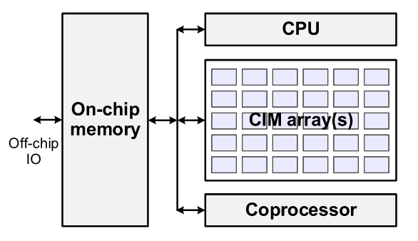
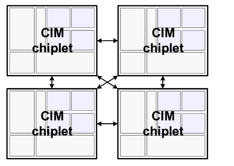

import { Aside } from 'astro-pure/user'

<Aside type='tip' title='Tips'>
Computing in memory (CiM) is an emerging technology that aims to improve computational efficiency by processing data directly within memory structures. This article provides an overview of the fundamental concepts behind CiM, common CiM architectures, and some of the trade-offs involved in their design.
</Aside>

## Overview

The overall CiM architecture can be divided into several levels:

- Circuit level: analog implementations based on current, voltage, or time, as well as digital implementations.
- Microarchitecture level.
- Processor level: in a basic CiM processor such as the one shown above, the array performs most of the computation. Buffers, controllers, and coprocessors prepare data and handle operations that the array cannot perform.
- Toolchain level: simulators model performance, energy consumption, and accuracy, while synthesis and mapping tools map real workloads onto CiM arrays.
- Application level.
- Future trends.

## Why CiM

### The Memory and Bandwidth Wall

In conventional computer architectures, computation and storage are generally separated. Results produced by the ALU must be written back to memory, while input data must first be read from memory into the ALU.

As processor performance continues to improve, computation becomes much faster, but the latency and energy cost of data movement remain. System performance is therefore increasingly constrained by moving data between memory and compute units. This problem is commonly known as the memory wall, and it becomes even more pronounced in AI workloads because of their enormous data volume.

The central idea of CiM is to move computation into the memory array and perform multiply-accumulate (MAC) operations within or near the memory cells.

CiM is not a general-purpose computing unit. It must work alongside general-purpose processors and other accelerators to support more complex operations.

## Circuit Level

At the physical level, CiM circuits can be roughly divided into the following types:

### Current-Based

Current-based designs use Kirchhoff's current law (KCL) to perform accumulation, followed by an analog-to-digital converter (ADC). These designs offer high density and occupy relatively little area, but they are sensitive to device characteristics and noise.

### Charge-Based

Capacitors can accumulate charge, and the resulting voltage change represents the computed value. An ADC then converts this analog value into a digital result. This approach generally requires a larger circuit area.

### Time-Based

A higher voltage requires more accumulated charge and therefore more charging time, so time can also serve as the measured quantity. A time-to-digital converter (TDC) converts the delay into a digital value. This approach is less sensitive to external disturbances, but the additional delay reduces its efficiency.

### Digital

Digital CiM offers higher precision and accumulates results through an adder tree. However, unlike the first three approaches, which exploit physical behavior for computation, digital implementations generally consume considerably more power.

## CiM Memory Circuits

CiM designs also require a choice of memory medium. The available technologies can be broadly divided into volatile memory, such as SRAM and eDRAM, and non-volatile memory, such as RRAM, MRAM, and ROM.

Their main characteristics are as follows:

- Volatile memory (SRAM/eDRAM): the SRAM-based design shown in (a) is robust and relatively easy to integrate, but its large cell area limits CiM efficiency. eDRAM can improve density, although eDRAM-based CiM requires periodic capacitor refreshes.
- Non-volatile memory (RRAM/MRAM/ROM): CiM based on non-volatile media can provide high compute density, but its design is more complex and often requires hardware-algorithm co-design.

## Microarchitecture Level

A CiM macro, shown below, can be roughly divided into a CiM compute array and peripheral processing circuits such as ADCs, DACs, and accumulation circuits. Its total energy consumption must therefore include both the array and the surrounding circuitry.

Using this model, the energy efficiency and latency of different CiM approaches can be evaluated experimentally. Increasing computational parallelism improves efficiency at first, but the benefit eventually saturates rather than increasing without limit. Latency also rises as parallelism increases. Among the various approaches, non-volatile-memory-based CiM exhibits a wider latency range. SRAM-based CiM generally has lower latency, and digital SRAM-based CiM achieves the lowest latency because its timing is tightly controlled and the computation can be pipelined.

Analog and digital CiM also face different performance limits. For analog CiM, the energy and speed of the ADCs and DACs often determine the upper bound. In digital CiM, adder trees account for substantial computational cost, and their size largely determines the available parallelism. Pursuing very high parallelism creates many routing paths, making placement and routing area difficult to manage while also introducing timing-closure problems.

## Processor-Level CiM Chips

The macros described above can be used to construct several types of CiM chips. The main architectures are outlined below.

### Single-Core and Pipelined CiM Architecture

This is the most basic form of a CiM chip. It alternates CiM arrays with buffers, and multiple stages can be cascaded to model neural networks built from stacked linear layers. If the buffers use a ping-pong double-buffering scheme, the architecture can also operate as a pipeline and achieve high computational efficiency.

### Homogeneous CiM Architecture

This architecture introduces multiple CiM arrays and uses scheduling logic to coordinate computation across them. Because many results are produced at once, the SIMD, accumulation, and rearrangement logic shown in the lower-right corner post-processes the array outputs to produce the final result.

### Heterogeneous CiM Architecture

Compared with the homogeneous architecture above, the CPU and coprocessor take on a larger share of the workload in this design. Computation across the CPU, coprocessor, and CiM array can therefore proceed in parallel, making this a heterogeneous architecture.

### Chiplet CiM Architecture

Making a single CiM array too large can introduce serious timing problems. To address this issue, researchers have proposed chiplet-based interconnect architectures. Each chiplet acts as an independent CiM chip, and the chiplets exchange data so that a larger computation can be partitioned across them.
