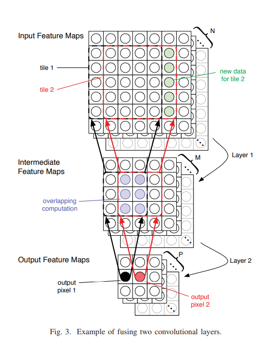
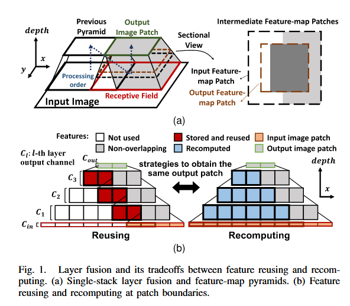
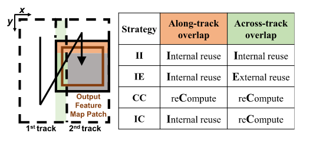
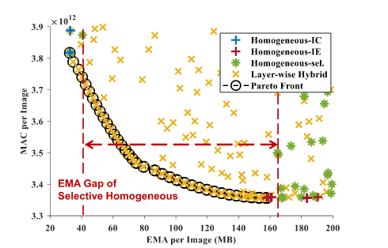
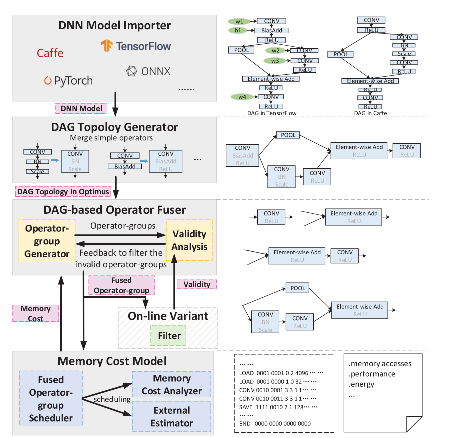
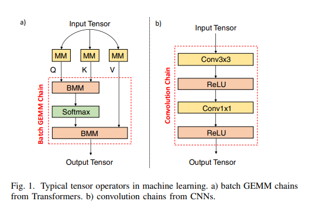
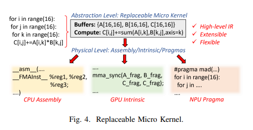
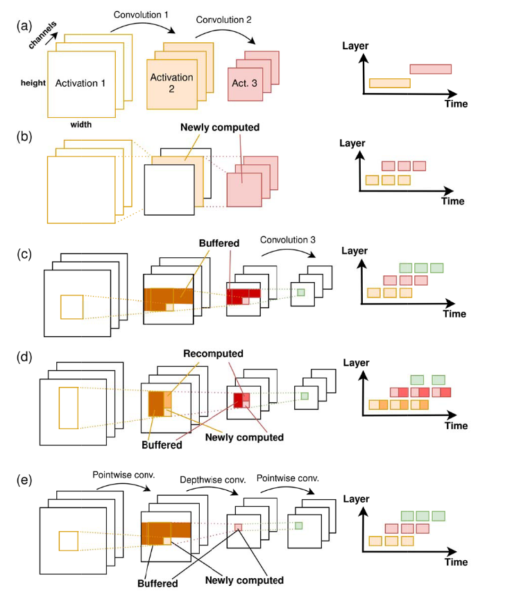

---
title: 'Paper Reading: Layer Fusion'
description: 'Efficiency is all we need.'
publishDate: '2026-02-27'
updatedDate: '2026-03-03'
category: Research
tags:
  - Architecture
heroImage:
  src: './Layer_Fusion.jpg'
  alt: '文章封面'
  color: '#B4C6DA'
draft: false
language: 'zh-CN'
comment: true
---

import {
  Aside, Tabs, TabItem, Steps, MdxRepl, Card, Collapse, CardList, Timeline,
  Button, Spoiler, FormattedDate, Label, Svg, Icon
} from 'astro-pure/user'
import { Quote, GithubCard, LinkPreview, QRCode, MediumZoom } from 'astro-pure/advanced'
import { Icons as allIcons } from 'astro-pure/libs'
import { Comment } from '@/components/waline'
import { Code } from 'astro:components'
import { Image } from 'astro:assets'
import myImage from './Layer_Fusion.jpg'

export const cardListData = [
  { title: '文档链接', link: '/docs' },
  { title: '二级目录', children: [{ title: '子项', link: '/docs/integrations/components' }] }
]

export const timelineData = [
  { date: '2026-02-20', content: '开始写作' },
  { date: '2026-02-27', content: '发布文章' }
]

<Aside type='tip' title='Tips'>
Layer Fusion是一种解决内存墙问题的技术，通过将多个层融合成一个层来减少内存访问次数，从而减少对内存的读写，下面几篇是关于Layer Fusion的文章，聚焦于基本方法和设计空间探索
</Aside>

## Fused-Layer CNN Accelerators
<div class='flex gap-2'>
  <a href='https://ieeexplore.ieee.org/abstract/document/7783725' target='_blank' rel='noopener noreferrer'>
    <Button as='div' title='Link' variant='pill' />
  </a>
</div>

### Intro
这篇文章首次提出了Layer Fusion的概念。在进行Neural Network的计算时，由于深度模型的多个Layers，存在许多的中间计算结果，也就是所说的中间特征图。
在一层的Layer计算完成后，我们需要将计算得到的中间特征图写回内存。再计算下一个Layer时，我们又需要将中间特征图从内存中读出来进行计算。

这种计算方式带来的问题是大部分计算时间被浪费在了数据在片上SRAM与内存DRAM中的传输中，也就是广为人知的内存墙问题。

为了解决这个问题，这篇文章首次提出了Layer Fusion的概念，希望能在SRAM中完成所有的计算，最后将结果一次写回内存。



由于片上SRAM有限的原因，对于数据我们希望能够得到最大程度的复用来减少对有限SRAM的占用，同时也可以达到提高计算效率的效果，因为数据复用减少了计算新数据的额外开销。

### Tradeoff
这里也存在一个tradeoff.我们将进行一次Fusion后的单元称为一个`Pyramid`.
对于多层的网络，在进行计算时如果进行多层的Fusion，也就是只需要一个Pyramid的情况下，则需要的片上SRAM空间会显著增大由于需要复用时存储的数据变多，
同样也会带来一些控制逻辑上的复杂性问题。如果考虑将一个网络的计算拆成多个Pyramid来计算，上述说的问题会显著改善，然后需要考虑的是两个Pyramid之间的数据交换仍要通过对内存的读写来进行，因此这部分的时间又增加了。这两者是设计时的一个tradeoff.

### Limitations
- 存储问题：细看我们可以知道这篇文章维护了BL和BT，也就是行复用和列复用。然而实际上列复用需要存储的数据远比行复用大很多，以至于对于是否需要列复用成为了一个问题。
- 缺少设计空间探索：这个基座对于Fuse的具体执行方式还仅限于极少的网络模型，缺乏一种能够针对不同的网络执行不同Fuse方式的探索
- 主要针对CNN的计算来进行，这些计算在经典的网络中大量出现，然而对于一些现代的网络涉及到的更加复杂的算子(Attention,depthwise,pointwise)这些计算往往不能用滑窗计算来替代

## Falcon
<div class='flex gap-2'>
  <a href='https://ieeexplore.ieee.org/abstract/document/10745739' target='_blank' rel='noopener noreferrer'>
    <Button as='div' title='Link' variant='pill' />
  </a>
</div>
### Intro

针对基座模型的存储问题，这篇文章再次放大了这个问题：如果片上存不了完成的输入特征图，此时存储问题会变得尤其严重。


这是因为，此时就需要以每一块patch的形式读入每个数据，此时会带来一个很大的问题就是如果再使用很多SRAM来存复用的数据，很可能导致片上无法容纳这么多数据。

### Methods
这篇文章提出的方法，首先将几种方式分了一下类。



其中Along可以理解成BL，Across可以理解成BT
- Internal reuse：存在片上复用
- External reuse：存在外部复用
- reCompute：重新计算
几种方式的结果



Homogeneous代表整个计算过程中都使用某一种策略。Homogeneous-sel代表整个计算按照Layer分为一些阶段，不同阶段之间的策略不同，单个阶段之间用同一种策略。Layer-wise Hybrid则是每一个Layer都用不一样的策略，也就是这篇文章提出的。
可以看到，全部使用IC和IE都存在一些缺陷，EMA（访问外部存储）量过大或计算量过大。而Homogeneous-sel则gap太大，是粗粒度的，不适合做设计空间探索。本文提出的方法粒度较细，适合做设计空间探索。

<Aside type='caution' title='Warning'>
设计空间的探索是有必要的，模型更新的速度肯定大于硬件更新的速度，下面几篇文章都是在探索设计空间，来帮助我们在面对不同的模型时能够有不同的策略来进行Layer Fusion
</Aside>

## ConvFusion
<div class='flex gap-2'>
  <a href='https://ieeexplore.ieee.org/abstract/document/9646923' target='_blank' rel='noopener noreferrer'>
    <Button as='div' title='Link' variant='pill' />
  </a>
</div>
### Intro
这篇是一个设计空间探索的论文，来量化进行Layer Fusion时的各种cost以及它们响应的来源，来帮助我们进行更加合适的设计。
### Theory
#### Scheduling Space
- Loop Reordering：计算时循环的顺序，越靠近内层的部分，对应的维度的数据越容易被复用，这会影响整体的调度逻辑
- Loop Tiling：在进行Tile分块计算时，通常是把一个Tile的数据读到片上进行计算，因此这个Tile有多大直接决定了能够复用的数据有多少
- Store & Compute Levels：在loop层面进行数据存储与计算的层次。其中Store Levels决定了需要存储多少数据在片上，Compute Levels决定了一次和外界进行数据交换的多少
- Layer Fusion：略
- Recomputation：略
#### Cost Models
文章规定了三种cost
- 内部Buffer需求，需要的片上存储空间
- 外部内存访问次数
- MACs

## Optimus
<div class='flex gap-2'>
  <a href='https://dl.acm.org/doi/full/10.1145/3520142' target='_blank' rel='noopener noreferrer'>
    <Button as='div' title='Link' variant='pill' />
  </a>
</div>
### Intro
相比于计算逻辑方面的设计空间探索，Optimus提出了一种框架来评估哪些算子可以被很好地融合来实现对于内存的较少访问。

### Architecture



这篇文章注重于Memory层次的优化，也就是最终目标是减少对于内存的访问。总体的Flow可以概括如下：
- 将模型描述成DAG
- DAG上先融合简单的Operators，减小后续的搜索空间
- 在DAG上应用算法，侯选出可能的融合组
- 应用Memory Cost Model计算出对应融合组的访存消耗

## Chimera
<div class='flex gap-2'>
  <a href='https://ieeexplore.ieee.org/abstract/document/10071018' target='_blank' rel='noopener noreferrer'>
    <Button as='div' title='Link' variant='pill' />
  </a>
</div>
### Intro
这篇文章也是一片设计空间探索的文章，主要讲的是针对计算密集模型(GEMM,Conv Chain)这类模型如何更高效地做Fusion.



### Design Space
有三个值得探索的点
- Block decomposition：同Optimus中提到的 Loop Tiling
- Inter-block reordering：融合后，仍然需要确定计算出来的数据是立即用于下一次计算还是存住，糟糕的oeder会导致SRAM和内存访问时间的极大浪费
- 一种表示：对于异构资源，希望能有一种表示，随后把这个表示翻译成对应的硬件操作，这是一种可移植性的权衡



## LoopTree
<div class='flex gap-2'>
  <a href='https://ieeexplore.ieee.org/abstract/document/10681620' target='_blank' rel='noopener noreferrer'>
    <Button as='div' title='Link' variant='pill' />
  </a>
</div>
### Intro
这篇是设计空间探索的文章，MIT的文章写得非常精简。



这里首先提出几种范式
(a):传统的计算
(b):在channel维度做分块，这种方式最多fuse两层因为后面没算完
(c):二维的分块，可以fuse若干
(d):在(c)的基础上再加上drop，节省下片上SRAM资源，但是需要重算
(e):面对一些新算子（Pointwise，Depthwise）时，这些算子没有可复用的区域，因此对于这种混合结构，需要灵活抉择片上需要存哪些数据
### Evaluation
有四个评价指标
- latency：推理消耗的时间
- energy：推理消耗的能量
- buffer capacity：片上需要的总缓存
- bandwidth usage：完成任务需要多大的带宽需求

{/* # 小组件

## Github风格的框

<Aside type='tip' title='Tips'>
Here is a tip for you.
</Aside>

<Aside type='caution' title='Warning'>
Warning occurs!
</Aside>

<Aside type='danger' title='Danger'>
Do not do this!
</Aside>

## Card
<Card as='a' href='#' heading='卡片标题' subheading='卡片副标题' date='Feb 2026'>
跳转到文章开头的卡片
</Card>

你好啊

<Card as='a' heading='卡片标题' subheading='卡片副标题' date='Feb 2026'>
不跳转
</Card>


## 折叠标签
<Collapse title='这里可以写不想让人看到的内容'>
Hello, this is some hidden content that can be revealed by clicking the title.
</Collapse>

## 标签页
<Tabs>
  <TabItem label='标签一'>这里是标签一内容</TabItem>
  <TabItem label='标签二'>这里是标签二内容</TabItem>
</Tabs>

## 步骤

<Steps>
1. 第一步
2. 第二步
3. 第三步
</Steps>

## 时间轴
<Timeline
  events={[
    { date: '2026-02-20', content: '开始写作' },
    { date: '2026-02-27', content: '发布文章' }
  ]}
/>


## 引用和批注
>hello

<MdxRepl width='100%'>
<p>小批注</p>
</MdxRepl>

## 按钮
<div class='flex gap-2'>
  <Button as='a' title='前进按钮' variant='ahead' />
  <Button as='div' title='返回按钮' variant='back' />
  <Button as='div' title='胶囊按钮' variant='pill' />
</div>

## 剧透
<Spoiler>这是剧透文本</Spoiler>

## Advanced 组件

显示语录
<Quote /> 
展示Github的仓库
<GithubCard repo='cworld1/astro-theme-pure' />
展示一个链接
<LinkPreview href='https://www.cloudflare.com/' hideMedia />
展示二维码
<QRCode content='https://github.com' class='inline-flex max-w-44 p-3 bg-muted rounded-lg border' />

## 图片与代码


<Code lang='bash' code={`echo "hello mdx"`} />

```bash title="deploy.sh"
bun check
bun dev # [!code highlight]
```

```diff
-bun run build # [!code --]
+bun format    # [!code ++]
``` */}
