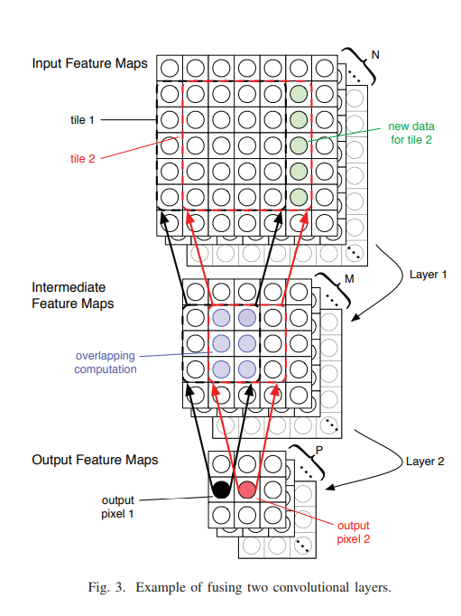
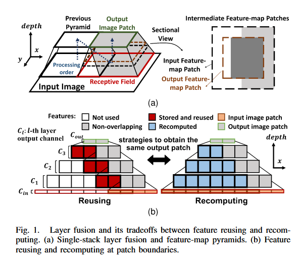
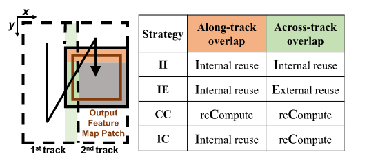
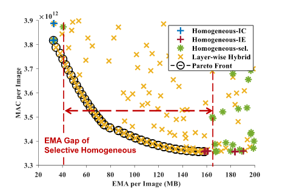
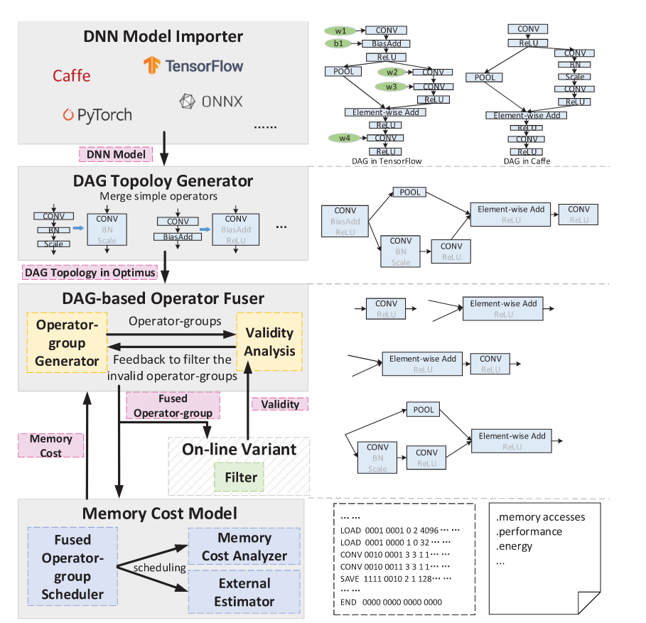
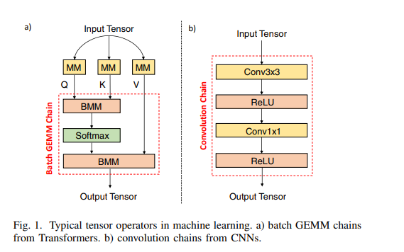
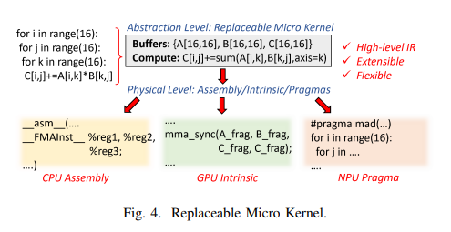
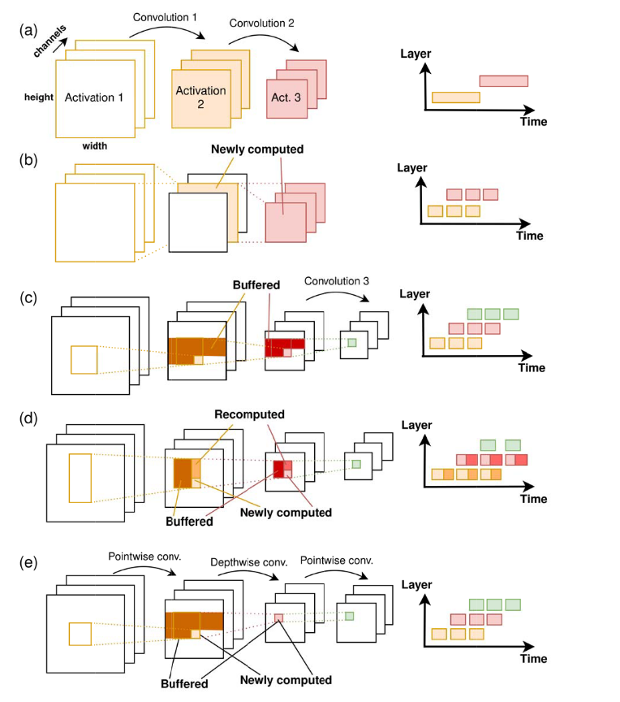

import { Aside, Button } from 'astro-pure/user'

<Aside type='tip' title='Tips'>
Layer fusion addresses the memory wall by fusing multiple neural network layers so that intermediate data can remain on chip. This reduces reads from and writes to external memory. The papers below cover the basic method and several approaches to design-space exploration.
</Aside>

## Fused-Layer CNN Accelerators

  <a href='https://ieeexplore.ieee.org/abstract/document/7783725' target='_blank' rel='noopener noreferrer'>
    <Button as='div' title='Link' variant='pill' />
  </a>

### Introduction

This paper introduced the concept of layer fusion. Deep neural networks contain many layers and therefore produce many intermediate results, commonly called intermediate feature maps. After one layer finishes, its output is normally written back to memory. When the next layer begins, that feature map must be read from memory again.

As a result, a large share of execution time is spent moving data between on-chip SRAM and off-chip DRAM. This is the familiar memory-wall problem.

To address it, the paper proposes completing the fused computation in SRAM and writing the final result back to memory only once.

Because on-chip SRAM is limited, data should be reused as much as possible. Reuse reduces the storage required for intermediate values and improves computational efficiency by avoiding the cost of repeatedly producing or fetching the same data.

### Trade-Offs

The paper calls one fused computation unit a `Pyramid`. If many layers are fused into a single Pyramid, substantially more on-chip SRAM is needed because more reused data must remain available. The control logic also becomes more complex.

Splitting a network across several Pyramids reduces these problems, but data exchanged between Pyramids must still be written to and read from external memory. This increases memory traffic again. Choosing the number and size of Pyramids is therefore a central design trade-off.

### Limitations

- Storage: the design maintains both BL and BT, corresponding to row and column reuse. Column reuse requires far more storage than row reuse, raising the question of whether its benefit justifies the cost.
- Limited design-space exploration: the proposed fusion strategy is evaluated on only a small set of networks and does not provide a general method for selecting different fusion strategies for different models.
- CNN focus: the method targets computations that are common in classic CNNs. More complex operators in modern networks, such as attention, depthwise convolution, and pointwise convolution, cannot always be represented by the same sliding-window computation.

## Falcon

  <a href='https://ieeexplore.ieee.org/abstract/document/10745739' target='_blank' rel='noopener noreferrer'>
    <Button as='div' title='Link' variant='pill' />
  </a>

### Introduction

Falcon expands on the storage problem in the original fused-layer design. The problem becomes especially severe when the complete input feature map cannot fit on chip.

In that case, data must be loaded patch by patch. If a large amount of SRAM is also reserved for reuse, the chip may be unable to hold all the required data at once.

### Method

The paper first classifies several reuse strategies.

`Along` can be understood as BL, while `Across` corresponds to BT.

- Internal reuse keeps reused data on chip.
- External reuse stores reused data outside the accelerator.
- Recompute calculates data again instead of storing it.

The results of these strategies are shown below.

`Homogeneous` applies one strategy throughout the entire computation. `Homogeneous-sel` divides the network into stages and selects one strategy for each stage. `Layer-wise Hybrid`, the method proposed by Falcon, allows a different strategy for every layer.

Using IC or IE everywhere has clear drawbacks: either external memory access (EMA) becomes excessive or the amount of recomputation becomes too large. `Homogeneous-sel` is coarse grained and leaves large gaps in the design space. The layer-wise method offers finer control and is therefore better suited to design-space exploration.

<Aside type='caution' title='Warning'>
Design-space exploration is necessary because models evolve faster than hardware. The following papers explore how different layer-fusion strategies can be selected for different models.
</Aside>

## ConvFusion

  <a href='https://ieeexplore.ieee.org/abstract/document/9646923' target='_blank' rel='noopener noreferrer'>
    <Button as='div' title='Link' variant='pill' />
  </a>

### Introduction

ConvFusion explores the design space by quantifying the costs of layer fusion and identifying where those costs originate. The goal is to support better design decisions.

### Theory

#### Scheduling Space

- Loop reordering: dimensions placed closer to the innermost loop are easier to reuse. Loop order therefore affects the overall scheduling logic.
- Loop tiling: a tile is usually loaded on chip before it is computed. Tile size directly determines how much data can be reused.
- Store and compute levels: these describe where data is stored and computed in the loop hierarchy. Store levels determine how much data must remain on chip, while compute levels determine how much data is exchanged with the outside world at a time.
- Layer fusion: the selected set and grouping of fused layers.
- Recomputation: the choice to recalculate values instead of storing them.

#### Cost Models

The paper defines three major costs:

- Required internal buffer capacity.
- Number of external memory accesses.
- Number of MAC operations.

## Optimus

  <a href='https://dl.acm.org/doi/full/10.1145/3520142' target='_blank' rel='noopener noreferrer'>
    <Button as='div' title='Link' variant='pill' />
  </a>

### Introduction

Instead of exploring only the design space of computation, Optimus proposes a framework for evaluating which operators can be fused effectively to reduce memory traffic.

### Architecture

The paper focuses on optimization across the memory hierarchy, with the final goal of reducing memory accesses. Its overall flow can be summarized as follows:

- Represent the model as a directed acyclic graph (DAG).
- Fuse simple operators in the DAG first to reduce the remaining search space.
- Apply an algorithm to identify candidate fusion groups.
- Use a memory cost model to evaluate the memory traffic of each candidate group.

## Chimera

  <a href='https://ieeexplore.ieee.org/abstract/document/10071018' target='_blank' rel='noopener noreferrer'>
    <Button as='div' title='Link' variant='pill' />
  </a>

### Introduction

Chimera also explores the design space, focusing on efficient fusion for compute-intensive workloads such as GEMM and convolution chains.

### Design Space

Three dimensions are especially important:

- Block decomposition: equivalent to the loop tiling discussed in Optimus.
- Inter-block reordering: after fusion, the schedule must decide whether produced data should be consumed immediately or stored for later use. A poor order can waste SRAM capacity and increase memory-access time substantially.
- Intermediate representation: heterogeneous hardware benefits from a common representation that can later be translated into hardware-specific operations. This introduces a trade-off between portability and specialization.

## LoopTree

  <a href='https://ieeexplore.ieee.org/abstract/document/10681620' target='_blank' rel='noopener noreferrer'>
    <Button as='div' title='Link' variant='pill' />
  </a>

### Introduction

LoopTree is another design-space exploration paper, presented in a particularly concise style.

The figure introduces several execution patterns:

- (a) Conventional layer-by-layer computation.
- (b) Tiling along the channel dimension. This can fuse at most two layers because later layers do not yet have complete inputs.
- (c) Two-dimensional tiling, which can fuse several layers.
- (d) Two-dimensional tiling with dropped intermediate data. This saves on-chip SRAM but requires recomputation.
- (e) A flexible strategy for mixed operators such as pointwise and depthwise convolution, where some operators have no reusable spatial region and the system must choose which values to keep on chip.

### Evaluation

LoopTree uses four evaluation metrics:

- Latency: time required for inference.
- Energy: energy consumed by inference.
- Buffer capacity: total on-chip buffer space required.
- Bandwidth usage: bandwidth required to complete the workload.
