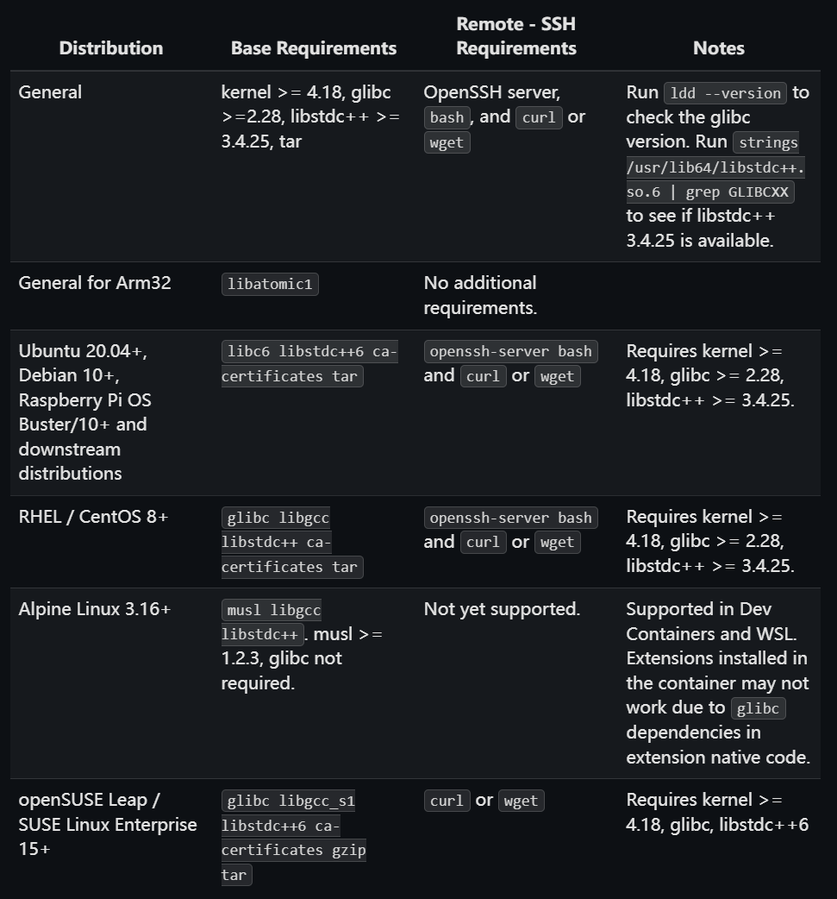

## Introduction

Because I do not have access to a commercial Synopsys license, I previously ran simulation and synthesis inside a virtual machine that already had the Synopsys tools installed. The problem was poor hardware utilization. The same project took much longer to simulate or synthesize in the virtual machine than it did with tools such as Vivado on Windows. The virtual machine's GUI was also far less pleasant to use than VS Code. I therefore decided to configure the Synopsys toolchain in WSL 2.

## Choosing the Environment

I wanted a Linux distribution that could be accessed through VS Code's Remote - WSL extension. The [VS Code documentation](https://code.visualstudio.com/docs/remote/linux) lists several distribution and version requirements.



CentOS generally offers good compatibility with EDA tools. However, I had heard that older Synopsys releases, including the versions available to me, can have additional limitations on CentOS, and I was less familiar with that distribution. I therefore chose Ubuntu 20.04.

The complete environment used in this guide is:

```text
Windows 11
WSL 2
Ubuntu 20.04.6 LTS
VS Code Remote - WSL
Synopsys 2018:
  SCL 2018.06
  VCS O-2018.09-SP2
  Verdi O-2018.09-SP2
  Design Compiler O-2018.06-SP1
```

## Installing WSL 2

Windows 11 does not appear to offer Ubuntu 20.04 directly in every installation flow. A default installation can also consume a great deal of space on the system drive. I chose to [download an image](https://releases.ubuntu.com/focal/) and import it manually instead. For x86-64 systems, download [ubuntu-20.04.6-wsl-amd64.wsl](https://releases.ubuntu.com/focal/ubuntu-20.04.6-wsl-amd64.wsl).

I prefer to store the image and the installed operating system separately:

```text
EDA-Tools
  - images
  - OS
```

Import the distribution with:

```powershell
wsl --import [distribution-name] [OS-directory] [image-file] --version 2
```

Then start it. My distribution is named `Ubuntu20.04-EDA`:

```powershell
wsl -d Ubuntu20.04-EDA
```

## Initial Configuration

First, configure an APT mirror. Using a proxy for the WSL distribution is another option.

The mirror configuration can be based on the [Tsinghua University Open Source Software Mirror](https://mirrors.tuna.tsinghua.edu.cn/help/ubuntu/). Ubuntu 20.04 is no longer shown in the current selector, so this is the configuration I used:

```text
# Ubuntu 20.04 LTS
deb https://mirrors.tuna.tsinghua.edu.cn/ubuntu/ focal main restricted universe multiverse
deb https://mirrors.tuna.tsinghua.edu.cn/ubuntu/ focal-updates main restricted universe multiverse
deb https://mirrors.tuna.tsinghua.edu.cn/ubuntu/ focal-backports main restricted universe multiverse
deb https://mirrors.tuna.tsinghua.edu.cn/ubuntu/ focal-security main restricted universe multiverse

# Source packages are normally unnecessary, so they remain disabled.
# deb-src https://mirrors.tuna.tsinghua.edu.cn/ubuntu/ focal main restricted universe multiverse
# deb-src https://mirrors.tuna.tsinghua.edu.cn/ubuntu/ focal-updates main restricted universe multiverse
# deb-src https://mirrors.tuna.tsinghua.edu.cn/ubuntu/ focal-backports main restricted universe multiverse
# deb-src https://mirrors.tuna.tsinghua.edu.cn/ubuntu/ focal-security main restricted universe multiverse
```

Reload the shell configuration when necessary:

```bash
source ~/.bashrc
```

After configuring the mirror, install the required dependencies:

```bash
sudo apt install -y \
  build-essential make gcc g++ gcc-multilib g++-multilib \
  vim nano wget curl unzip tar gzip bzip2 file \
  csh ksh tcsh net-tools iproute2 lsb-release \
  x11-apps mesa-utils \
  libx11-6 libxext6 libxi6 libxrender1 libxtst6 libxss1 \
  libxft2 libxmu6 libxpm4 libxrandr2 libgtk2.0-0 \
  libncurses5 libtinfo5 \
  libcanberra-gtk-module libcanberra-gtk3-module \
  fontconfig xfonts-base xfonts-75dpi xfonts-100dpi
```

Some other guides list `libnsl2` as a requirement. It may not be installable in this environment and can prevent parts of a GUI-oriented installation from completing, but I later found that it was not required for my setup.

Install the remaining graphical packages:

```bash
sudo apt install -y x11-apps mesa-utils xterm
```

## Replacing dash

Ubuntu uses `dash` as the default implementation of `/bin/sh`, while Synopsys scripts expect behavior closer to Bash. Reconfigure the shell with:

```bash
echo "dash dash/sh boolean false" | sudo debconf-set-selections
sudo DEBIAN_FRONTEND=noninteractive dpkg-reconfigure dash
```

Verify the result:

```bash
ls -l /bin/sh
```

The expected output is:

```text
/bin/sh -> bash
```

## Installing MobaXterm

The Synopsys installer uses a graphical interface. GUI support in a VS Code remote environment can be inconvenient, so I used [MobaXterm](https://mobaxterm.mobatek.net/) to run the installer and other graphical tools.

## Preparing the Installation Packages

At this point, the base WSL 2 environment is ready and the Synopsys installation packages can be prepared.

[This article](https://zhuanlan.zhihu.com/p/332589990) describes the Synopsys 2018 packages used in the original setup. Make sure that you obtain and use Synopsys software and licenses through channels permitted by your organization and the applicable license agreement.

After downloading and extracting the packages, copy them into WSL 2. Windows drives are exposed as mount paths. For example:

```text
/mnt/f/Synopsys/Synopsys2018/synopsysinstaller_v5.0.rar
```

The package names used here are:

- Installer: `synopsysinstaller_v5.0.rar`
- VCS: `vcs_vO-2018.09-SP2`
- Design Compiler: `syn_vO-2018.06-SP1`
- Verdi: `verdi-2018.09`
- SCL: `scl_v2018.06`

Use `cp -av` to copy the packages into the distribution. I recommend keeping installation packages under the home directory and installing the software itself under `/opt/synopsys`.

```bash
mkdir -p ~/eda/synopsys/installer
```

```bash
sudo mkdir -p /opt/synopsys
```

## Running Synopsys Installer

After extracting the installer, enter its directory, grant execute permission, and start it:

```bash
cd ~/eda/synopsys/installer/synopsysinstaller_v5.0
chmod +x SynopsysInstaller_v5.0.run
./SynopsysInstaller_v5.0.run
```

If the extracted package provides `setup.sh`, run:

```bash
chmod +x setup.sh
./setup.sh
```

I recommend installing the tools in this order:

```text
1. SCL 2018.06
2. VCS O-2018.09-SP2
3. Verdi O-2018.09-SP2
4. Design Compiler O-2018.06-SP1
```

For the detailed installer flow and path selection, refer to the linked article. The first path selected in the installer is the location of the installation package. The second is the software installation directory under `/opt/synopsys`.

## Configuring the License

The license setup also follows the [linked article](https://zhuanlan.zhihu.com/p/332589990). Use only a valid license that you are authorized to run.

One important detail is that the host name usually differs from the article's `localhost.localdomain`. I am not completely certain which parts of this step are necessary in every environment, but configuring the hosts file can prevent a mismatch between the host name and the license.

```bash
sudo cp /etc/hosts /etc/hosts.bak
sudo nano /etc/hosts
```

An example configuration is:

```text
127.0.0.1       localhost localhost.localdomain
127.0.1.1       Puff Puff.localdomain

# The following lines are desirable for IPv6-capable hosts.
::1             localhost ip6-localhost ip6-loopback
fe00::0         ip6-localnet
ff00::0         ip6-mcastprefix
ff02::1         ip6-allnodes
ff02::2         ip6-allrouters
```

Replace `Puff` with your own host name. A manually managed hosts file can prevent the VS Code WSL service from reconnecting if WSL overwrites it. Edit `/etc/wsl.conf` as follows:

```ini
[network]
generateHosts = false

[user]
default = puff
```

Replace `puff` with your WSL user name. If your existing file contains unrelated settings, preserve the ones your environment needs.

## Configuring Environment Variables

This step adds the tools to the system path and configures the license server. Add the following content to `~/.bashrc`:

```bash
# ================= Synopsys 2018 =================

export SYNOPSYS_ROOT=/opt/synopsys

# VCS / DVE
export VCS_HOME=$SYNOPSYS_ROOT/vcs/O-2018.09-SP2
export VCS_MX_HOME=$SYNOPSYS_ROOT/vcs-mx/O-2018.09-SP2
export DVE_HOME=$VCS_HOME

# Verdi
export VERDI_HOME=$SYNOPSYS_ROOT/verdi/Verdi_O-2018.09-SP2

# SCL
export SCL_HOME=$SYNOPSYS_ROOT/scl/2018.06

# Design Compiler
export DC_HOME=$SYNOPSYS_ROOT/syn/O-2018.06-SP1

# Executable path
export PATH=$SCL_HOME/linux64/bin:$VCS_HOME/bin:$VCS_HOME/gui/dve/bin:$VERDI_HOME/bin:$DC_HOME/bin:$PATH

# Library path
export LD_LIBRARY_PATH=$VERDI_HOME/share/PLI/VCS/LINUX64:$VCS_HOME/linux64/lib:$LD_LIBRARY_PATH

# Compatibility
export VCS_ARCH_OVERRIDE=linux

# License server
export LM_LICENSE_FILE=27000@Puff
export SNPSLMD_LICENSE_FILE=$LM_LICENSE_FILE

# Manual license control
alias start-eda='lmgrd -c /opt/synopsys/scl/2018.06/admin/license/Synopsys.dat -l ~/lmgrd.log'
alias lms_synopsys='lmstat -a -c 27000@Puff'
alias lmk_synopsys='pkill -f lmgrd; pkill -f snpslmd'

# =================================================
```

`start-eda` is the command I use to start the license manager. Adjust the paths, host name, and port for your authorized environment.

For later sessions, start the license manager with:

```bash
start-eda
```

## Toolchain Dependencies

VCS and Design Compiler may require older libraries. This is a common compatibility problem when old EDA releases are used on a newer operating system, but the following workarounds solved the issues in this environment.

### VCS

On its first launch, VCS reported:

```text
/opt/synopsys/vcs/O-2018.09-SP2/bin/vcs: line 3312: dc: command not found
```

Install `dc`:

```bash
sudo apt install -y dc
```

The build log may also contain many linker errors:

```text
/usr/bin/ld: ... undefined reference to ...
collect2: error: ld returned 1 exit status
```

Ubuntu 20.04 cannot link `simv` correctly with the default options used by this release. Add the following VCS link option when compiling:

```bash
-LDFLAGS "-Wl,--no-as-needed"
```

### Verdi

Verdi requires `libpng12.so.0`. Install the older package with:

```bash
cd /tmp
wget http://security.ubuntu.com/ubuntu/pool/main/libp/libpng/libpng12-0_1.2.54-1ubuntu1.1_amd64.deb
sudo dpkg -i libpng12-0_1.2.54-1ubuntu1.1_amd64.deb
```

### Design Compiler

Design Compiler requires `libtiff.so.3` and `libmng.so.1`. Install the available libraries and create compatibility symbolic links:

```bash
sudo apt install -y libtiff5
sudo ln -sf /usr/lib/x86_64-linux-gnu/libtiff.so.5 /usr/lib/x86_64-linux-gnu/libtiff.so.3
sudo ldconfig
```

```bash
sudo apt install -y libmng2
sudo ln -sf /usr/lib/x86_64-linux-gnu/libmng.so.2 /usr/lib/x86_64-linux-gnu/libmng.so.1
sudo ldconfig
```

## Getting Started

The installation is now complete. Check that VCS, Design Compiler, and Verdi all start correctly.

For a more comfortable development environment, I also recommend:

- The Digital HDL extension for syntax highlighting.
- Codex or Copilot for investigating environment-specific problems that are not covered here.
