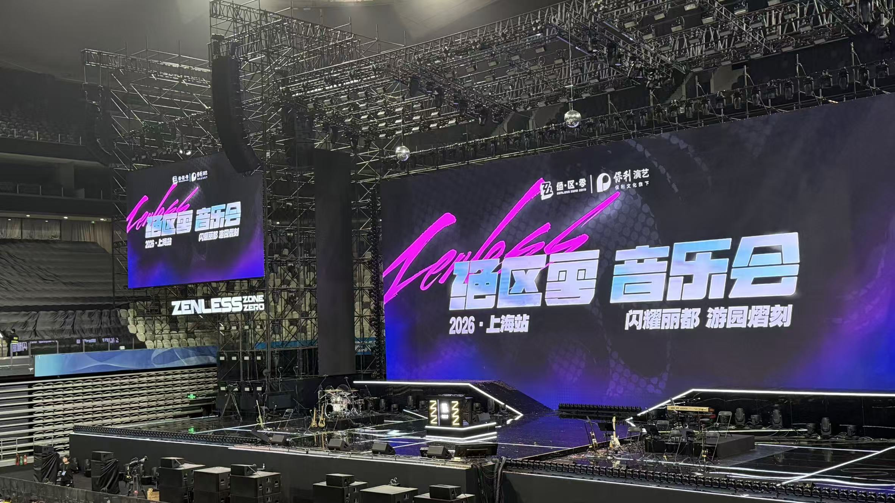
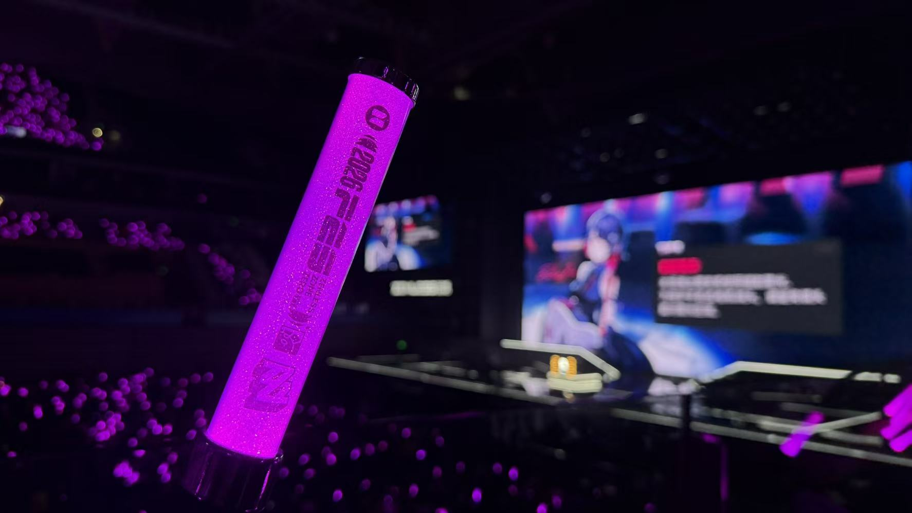
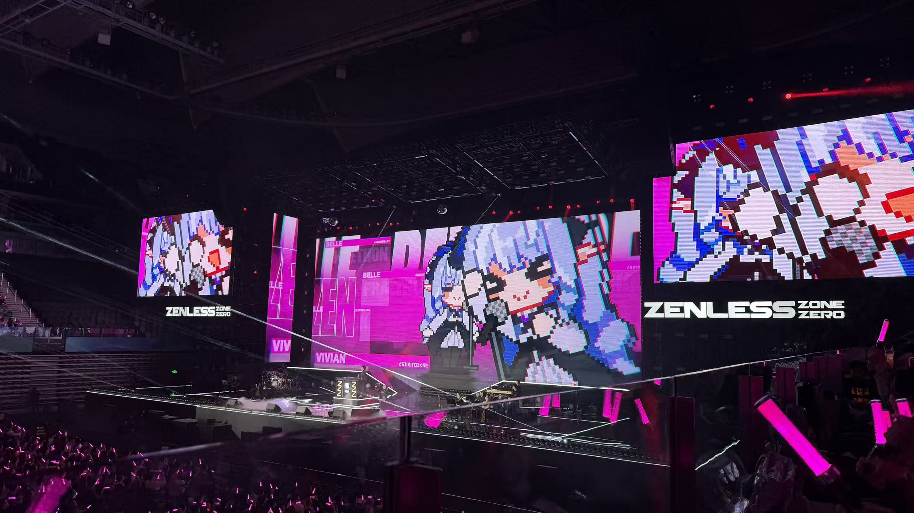
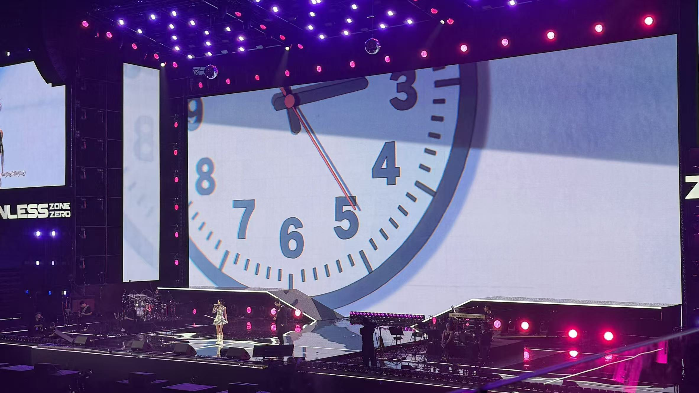
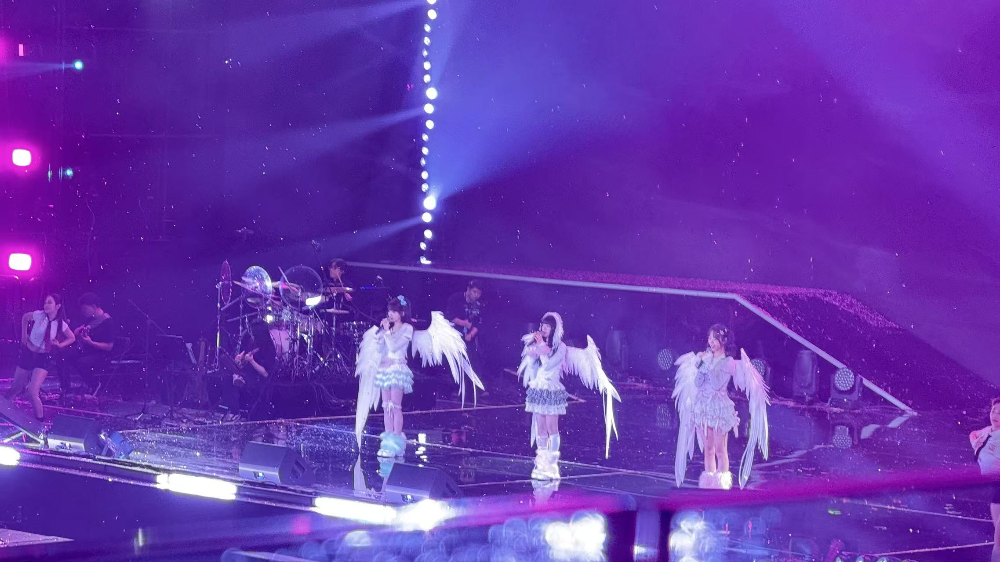
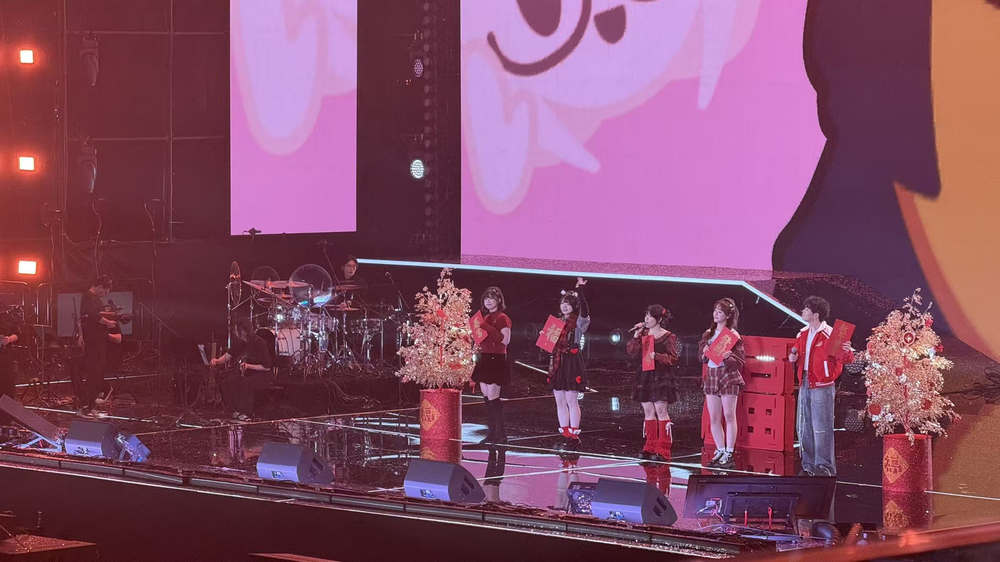
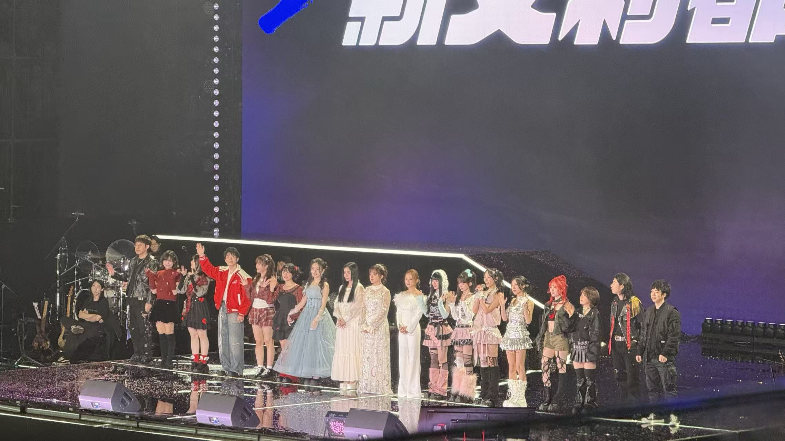

---
title: '2026 绝区零音乐会'
description: '记录下2026年初的绝区零音乐会'
publishDate: '2026-02-27'
updatedDate: '2026-02-27'
category: Daily
tags:
  - Concert
heroImage:
  src: './ZZZ.jpg'
  alt: '文章封面'
  color: '#B4C6DA'
draft: false
lang: zh
language: 'zh-CN'
translationKey: 'zenless-zone-zero-concert-2026'
comment: true
---

import {
  Aside, Tabs, TabItem, Steps, MdxRepl, Card, Collapse, CardList, Timeline,
  Button, Spoiler, FormattedDate, Label, Svg, Icon
} from 'astro-pure/user'
import { Quote, GithubCard, LinkPreview, QRCode, MediumZoom } from 'astro-pure/advanced'
import { Icons as allIcons } from 'astro-pure/libs'
import { Comment } from '@/components/waline'
import { Code } from 'astro:components'
import { Image } from 'astro:assets'
import myImage from './ZZZ.jpg'

export const cardListData = [
  { title: '文档链接', link: '/docs' },
  { title: '二级目录', children: [{ title: '子项', link: '/docs/integrations/components' }] }
]

export const timelineData = [
  { date: '2026-02-20', content: '开始写作' },
  { date: '2026-02-27', content: '发布文章' }
]

> 这是我第一次去听音乐会，之前我也有一些很想去的，比如音律联觉等等，但都因为一些原因没去成，因此这次趁着寒假回家爽听。

## 场馆和入场前
这次是在浦发银行东方体育中心，交通来说不算非常偏，坐地铁就能直达。

下面是场馆，应援棒和舞台。

## 节目
这次因为一些原因任何外国的歌手都没来，Damidami这样的歌甚至只是在大屏幕上放了个视频和舞蹈表演，感觉有点可惜。(不如FES)

我基本都是在听，拍的比较少，下面是一些照片。

### 法厄同之歌

### 艾莲EP

### 三小只

### 配音的节目

## 谢幕

## 个人感受

这次很多节目没听到比较可惜，但是演出质量还是不错的。于梓贝老师是唱了三首歌，第二天的状态非常稳。青衣的EP歌手也非常厉害！和FES相比，观众的热情可能没那么高但是也很顶了，
大家都在玩梗，氛围还是很不错的。
