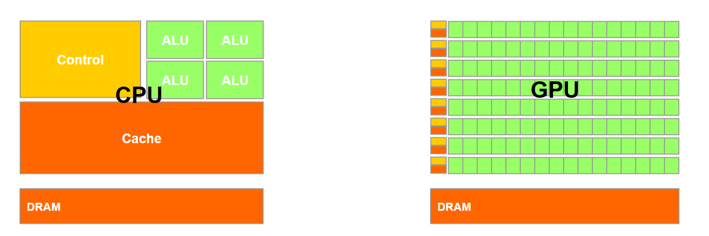
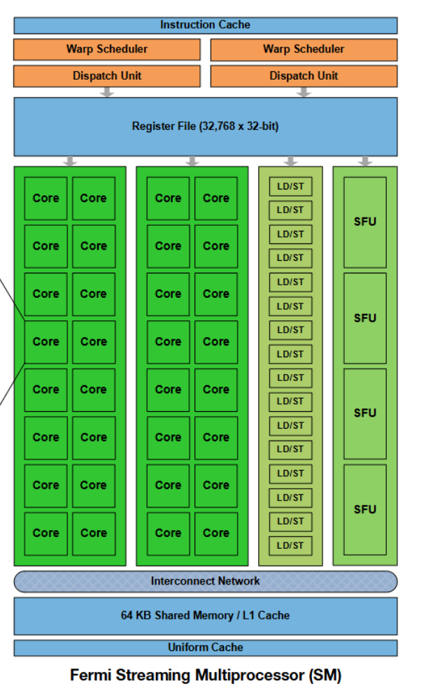
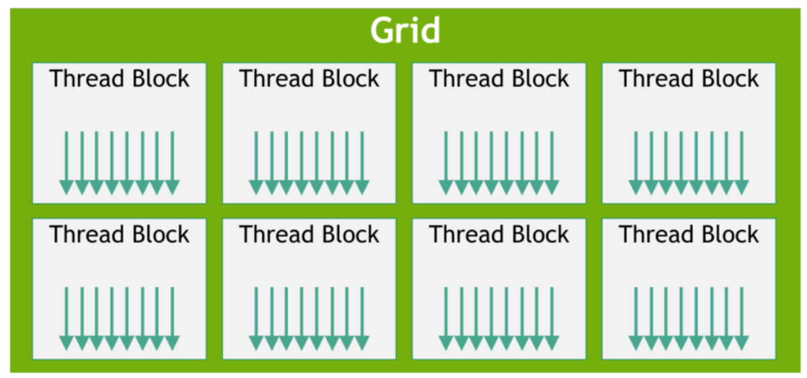
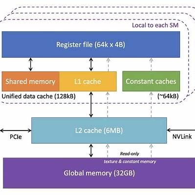
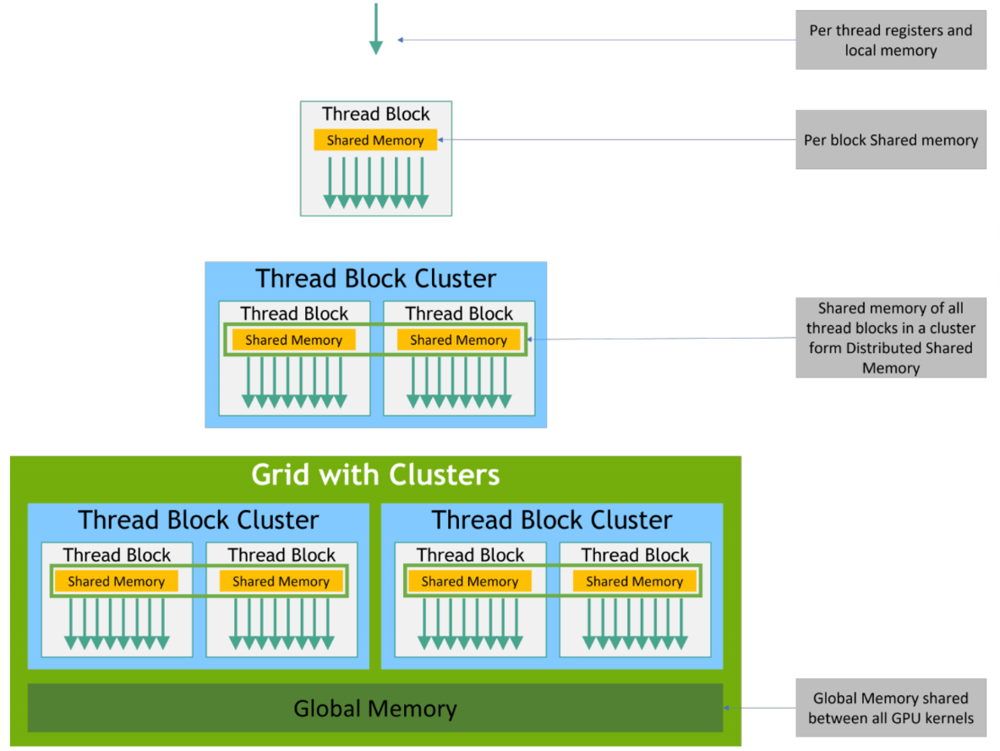

import { Aside } from 'astro-pure/user'

## Overall Architecture

<Aside type='tip' title='Tips'>
Modern models require enormous amounts of computation. Originally designed for graphics processing, GPUs are now widely used as parallel computing devices for workloads with high compute density and abundant parallelism.
</Aside>



Compared with a CPU, a GPU dedicates less hardware to control logic. A major execution unit inside a GPU is called an SM, or Streaming Multiprocessor. An SM generally contains the following components:

- CUDA cores perform multiply-accumulate operations and can be viewed as the GPU's ALUs.
- Special Function Units (SFUs) handle operations such as trigonometric functions.
- Load/Store units move data between memory and the execution units.
- The warp scheduler selects a ready warp from the many resident warps and sends it to a dispatch unit. A warp is usually a group of 32 threads.
- The dispatch unit assigns the selected warp to CUDA cores, Load/Store units, or SFUs for execution.



## From Hardware to Software

Non-CPU accelerators generally come with a supporting software stack. From the bottom up, the stack looks like this:

```text
Hardware -> Driver -> Runtime -> Libraries
```

Developers usually interact with the runtime and library layers.

## Thread Hierarchy and Management



A GPU must manage a very large number of threads. When a kernel is launched, its threads are organized into a hierarchy.

Multiple threads form a thread block, and multiple thread blocks form a grid. During execution, all threads in the same thread block run on the same SM.

Within a thread block, threads are further grouped into warps and execute the same instruction together. Because many warps are available, the scheduler can continually send ready warps to compute or memory resources, helping keep the GPU occupied.

## Memory Hierarchy

<Aside type='tip' title='Tips'>
Like a CPU, a GPU has its own memory hierarchy.
</Aside>



The main memory spaces are:

- Register file: private to each thread. Register contents disappear when the thread finishes.
- Shared memory: shared by the threads in a thread block.
- Global memory: off-chip graphics memory that can be accessed by the entire grid.



The host and device do not share the same memory space by default. Memory must first be allocated on the GPU, after which data can be copied from the CPU.

```cpp
cudaError_t cudaMalloc(void** devPtr, size_t count);
```

When calling `cudaMalloc`, the destination pointer is commonly cast to `void**`:

```cpp
cudaMalloc((void **)&d_a, size);
```

Because a pointer-to-pointer is required, the address of `d_a` is passed as `&d_a`. This allocates `size` bytes of global device memory.

```cpp
cudaError_t cudaFree(void* devPtr);
```

`cudaFree` releases device memory.

```cpp
cudaError_t cudaMemcpy(void* dst, const void* src, size_t count, cudaMemcpyKind kind);
```

`cudaMemcpy` copies data. The `cudaMemcpyKind` argument has four common values:

- `cudaMemcpyHostToHost`: host to host.
- `cudaMemcpyHostToDevice`: host to device.
- `cudaMemcpyDeviceToDevice`: device to device.
- `cudaMemcpyDeviceToHost`: device to host.

## Shared and Global Memory

If shared memory is not explicitly allocated, data is generally placed in global memory. Static shared memory can be declared as follows:

```cpp
__shared__ int smem[256];
```

Shared memory belongs to an SM and is shared within a thread block, so its allocated size must be chosen together with the number of threads in the block.
